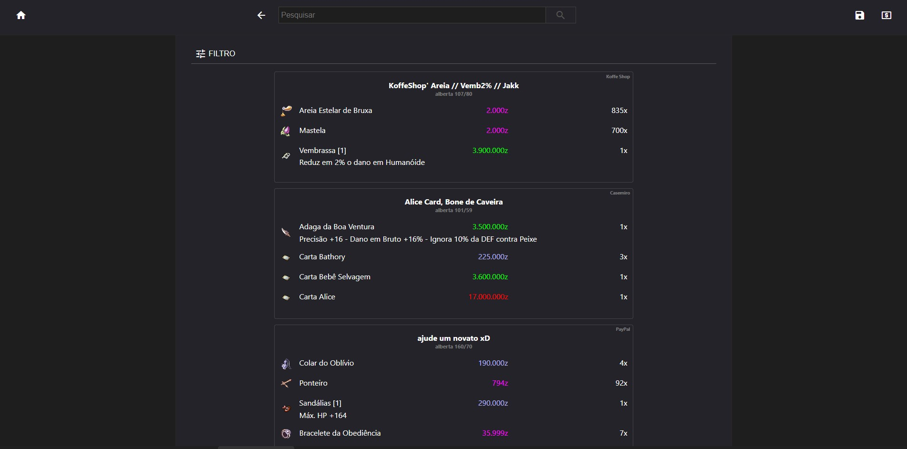

# Ragnarok Mercado



## Descrição

O Ragnarok Mercado é um aplicativo que permite pesquisar itens vendidos por lojinhas no jogo Ragnarok Online. Com ele, você pode filtrar os itens por categoria e bônus, facilitando a busca por itens específicos. Além disso, você pode salvar lojas que você gostou e verificar os itens vendidos mais tarde.

Você pode acessar o aplicativo clicando [aqui](https://ragnarok-mercado.surge.sh/).

## Tecnologias Utilizadas

O projeto foi desenvolvido utilizando a seguinte tecnologia:

- React

## Como Executar o Projeto

Para executar o projeto em sua máquina local, siga os passos abaixo:

1. Faça o clone deste repositório em um diretório de sua preferência utilizando o seguinte comando:

```
git clone git@github.com:albertoflorence/ragnarok-mercado.git
```

2. Navegue até o diretório do projeto:

```
cd ragnarok-mercado
```

3. Instale as dependências necessárias executando o seguinte comando:

```
npm install
```

4. Com todas as dependências instaladas, agora você pode iniciar o aplicativo usando o seguinte comando:

```
npm start
```

O aplicativo será iniciado e estará acessível em [http://localhost:3000](http://localhost:3000).

## Funcionalidades

- Pesquisar itens vendidos por lojinhas no jogo Ragnarok Online.
- Filtrar os itens por categoria e bônus para facilitar a busca.
- Salvar lojas favoritas para acesso rápido no futuro.
- Visualizar os itens vendidos mais tarde.

## Estrutura do Projeto

Aqui está uma breve visão geral da estrutura de pastas do projeto:

```
ragnarok-mercado/
  ├── src/
  │   ├── components/
  │   ├── store/
  │   ├── api/
  │   ├── App.js
  │   ├── index.js
  │   └── ...
  ├── public/
  │   ├── index.html
  │   └── ...
  ├── package.json
  ├── README.md
  └── ...
```

- A pasta `src` contém todos os arquivos do código-fonte do aplicativo.
- `components` contem os componentes React utilizados no aplicativo.
- `store` contém as funções de filtragem da aplicação.
- `api` contém as funções de acesso à API do projeto.
- `App.js` é o componente raiz do aplicativo que controla a estrutura geral da aplicação.
- `index.js` é o ponto de entrada do aplicativo, onde ele é renderizado na página HTML.
- A pasta `public` contém arquivos estáticos, como o arquivo `index.html`, que é a página base do aplicativo.

Sinta-se à vontade para explorar e modificar o código conforme suas necessidades.
